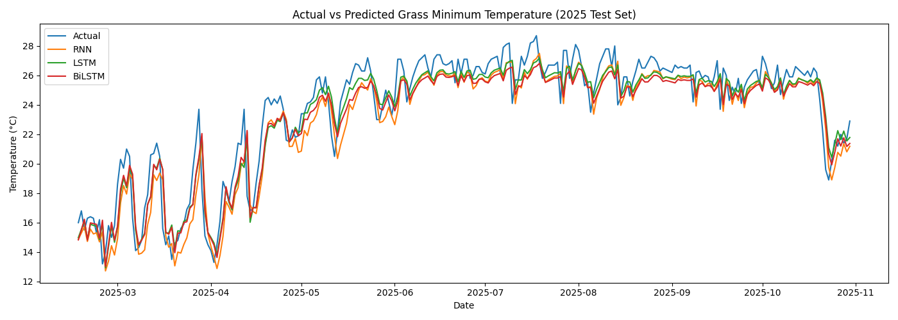
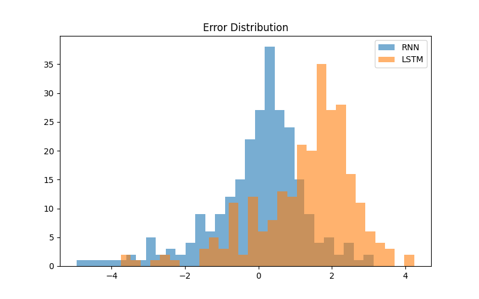

# DIT5411 Machine Learning Project
## Forecasting Hong Kong Daily Grass Minimum Temperature using RNN, LSTM, and BiLSTM

This project develops and compares three deep learning models—Simple RNN, LSTM, and Bidirectional LSTM—to forecast Hong Kong’s daily grass minimum temperature using historical data from the Hong Kong Observatory (HKO). The workflow follows the official DIT5411 Machine Learning Project requirements, including data preprocessing, sequence generation, model development, evaluation, visualisation, and documentation.

<<<<<<< HEAD
## Table of Contents

Project Overview

Dataset and Preprocessing

Project Structure

Model Architectures

Training and Evaluation

Results

Visualisations

How to Run the Project

Discussion and Future Work

Dataset Reference

=======
>>>>>>> da4826166769f200ea7c61d7a66faaf2d50fea9e
## Project Overview

Grass minimum temperature is an important meteorological indicator reflecting radiative cooling and seasonal variation. The dataset is smooth, highly seasonal, and predictable, making it suitable for sequential deep learning models.

This project includes:

Training models using data from 1980–2024

Testing on unseen data from 2025-01-01 to 2025-10-30

Comparing RNN, LSTM, and BiLSTM performance

Analysing prediction errors

Documenting the entire workflow in GitHub
<<<<<<< HEAD

## Dataset and Preprocessing

Source: Hong Kong Observatory Daily Grass Minimum Temperature dataset.

Main preprocessing steps:

Load the raw CSV (daily_HKO_GMT_ALL.csv).

Parse date fields and construct a continuous daily time index.

Handle missing values using time-based interpolation.

Restrict the usable range from 1980-01-01 to 2025-10-30.

Save the cleaned series as processed_HKO_GMT_ALL.csv.

For modelling, the data are transformed into supervised learning samples using a sliding window of 45 days to predict the next day’s grass minimum temperature.
=======
>>>>>>> da4826166769f200ea7c61d7a66faaf2d50fea9e

## Project Structure

Project/

daily_HKO_GMT_ALL.csv — Raw HKO dataset

processed_HKO_GMT_ALL.csv — Cleaned dataset

data_preprocessing.py — Cleaning, interpolation, datetime handling
<<<<<<< HEAD

sequence_generator.py — Sliding-window (45 days) sequence generation

models_rnn_lstm.py — RNN, LSTM, BiLSTM model definitions

train_and_evaluate.py — Training, evaluation, visualisation

hyperparameter_tuning.py — Optional: window sizes (30/45/60)

models/

rnn_model.h5

lstm_model.h5

bilstm_model.h5

figures/

actual_vs_predicted.png

error_distribution.png

## Model Architectures

All models are implemented with TensorFlow/Keras using a sequence-to-one setup: a 45-day input window predicts the next day’s grass minimum temperature.

Simple RNN model (baseline):

Input: shape (45, 1)

SimpleRNN layer with 64 units

Dense layer with 32 units (ReLU)

Output Dense layer with 1 unit (linear)

LSTM model:

Input: shape (45, 1)

LSTM layer with 64 units

Dropout layer (rate 0.2)

Dense layer with 32 units (ReLU)

Output Dense layer with 1 unit (linear)

Bidirectional LSTM model:

Input: shape (45, 1)

Bidirectional LSTM layer with 64 units

Dropout layer (rate 0.2)

Dense layer with 32 units (ReLU)

Output Dense layer with 1 unit (linear)

All models use the Adam optimizer with mean squared error (MSE) as the loss function and report mean absolute error (MAE) as an additional metric.

## Training and Evaluation

Training configuration:

Optimizer: Adam

Loss: Mean Squared Error (MSE)

Metric: Mean Absolute Error (MAE)

Epochs: 80

Batch size: 32

Train/validation split: 90% / 10% on the training period

Input window length: 45 days

Evaluation:

Models are evaluated on the held-out test period from 2025-01-01 to 2025-10-30.

Performance is measured using MAE and RMSE on the original (inverse-scaled) temperature values.
=======

sequence_generator.py — Sliding-window (45 days) sequence generation

models_rnn_lstm.py — RNN, LSTM, BiLSTM model definitions

train_and_evaluate.py — Training, evaluation, visualisation

hyperparameter_tuning.py — Optional: window sizes (30/45/60)

models/

rnn_model.h5

lstm_model.h5

bilstm_model.h5

figures/

actual_vs_predicted.png

error_distribution.png

## How to Run the Project

### 1. Install required libraries

Run the following command in your environment:
pip install pandas numpy scikit-learn tensorflow matplotlib

### 2. Preprocess the dataset

Run:
python data_preprocessing.py

This script loads the raw dataset, handles missing values with time-based interpolation, converts date fields to datetime format, and outputs the cleaned file processed_HKO_GMT_ALL.csv.

### 3. Train and evaluate the models

Run:
python train_and_evaluate.py
>>>>>>> da4826166769f200ea7c61d7a66faaf2d50fea9e

This script will:

<<<<<<< HEAD
### Numerical Performance (2025 Test Set)

Model	MAE (°C)	RMSE (°C)
RNN	1.02	1.35
LSTM	1.10	1.40
BiLSTM	1.14	1.42

The Simple RNN achieves the best overall performance, with the lowest MAE and RMSE among the three models.

## Visualisations

The repository includes two key figures in the figures/ directory.

actual_vs_predicted.png

Line plot of actual grass minimum temperature versus predictions from RNN, LSTM, and BiLSTM over the 2025 test period.

Demonstrates that all models capture the main seasonal pattern, including winter lows and summer highs.

error_distribution.png

Histogram of prediction errors for all three models.

Helps identify days with larger deviations, often corresponding to rapid temperature drops or transitional periods between seasons.
=======
Generate train/test sequences (45-day window → next-day prediction)

Train RNN, LSTM, and BiLSTM models

Evaluate each model using MAE and RMSE

Save trained models into the models/ directory

Produce visualisation plots in the figures/ directory

### 4. Optional hyperparameter tuning

Run:
python hyperparameter_tuning.py

This experiment tests different sliding-window lengths (30, 45, 60 days). The final project uses a 45-day window, which produced stable and consistent results.

## Evaluation Results (2025 Test Set)

Model	MAE (°C)	RMSE (°C)
RNN	1.02	1.35
LSTM	1.10	1.40
BiLSTM	1.14	1.42

Training configuration:

Optimizer: Adam

Loss: Mean Squared Error (MSE)

Epochs: 80

Batch size: 32

Sliding window: 45 days

## Visualisations

### actual_vs_predicted.png

A comparison of actual 2025 temperatures with predictions from RNN, LSTM, and BiLSTM. All models capture the overall seasonal trend, including winter lows and summer highs.

### error_distribution.png

A histogram showing prediction errors from all three models. This visualisation highlights days with unusually large deviations, often related to rapid temperature drops or seasonal transitions.
>>>>>>> da4826166769f200ea7c61d7a66faaf2d50fea9e

If desired, these figures can be embedded in Markdown:

<<<<<<< HEAD

## How to Run the Project

### 1. Install required libraries

Run the following command in your Python environment:
pip install pandas numpy scikit-learn tensorflow matplotlib

### 2. Preprocess the dataset

Run:
python data_preprocessing.py

This script loads the raw dataset, interpolates missing values, converts dates, and writes the cleaned file processed_HKO_GMT_ALL.csv.

### 3. Train and evaluate the models

Run:
python train_and_evaluate.py

This script will:

Generate train and test sequences using a 45-day sliding window.

Train RNN, LSTM, and BiLSTM models.

Evaluate the models on the 2025 test set using MAE and RMSE.

Save the trained models into the models/ directory.

Generate evaluation plots in the figures/ directory.

### 4. Optional hyperparameter tuning

Run:
python hyperparameter_tuning.py

This experiment compares alternative window sizes (30, 45, 60 days).
The final configuration uses a 45-day window, which provides a good balance between stability and performance.

## Discussion and Future Work

### Model Performance

The Simple RNN achieved the best accuracy among the three models. Because the grass minimum temperature series is smooth, seasonal, and relatively low in noise, a simpler recurrent architecture is sufficient to model its dynamics.

### Why LSTM and BiLSTM did not outperform RNN

LSTM and BiLSTM networks are designed to handle complex, nonlinear time dependencies and high-variance sequences. In this dataset:

Seasonal cycles are strong and regular.

Irregularities and extreme events are relatively rare.

Variance is moderate and dominated by predictable annual patterns.

As a result, the additional complexity of LSTM and BiLSTM does not provide an advantage over the simpler RNN baseline.

### Error Analysis

Larger prediction errors typically occur during:

Sudden temperature drops, such as cold surges.

Transitional periods between seasons, where trends change rapidly.

Isolated extreme events that are underrepresented in the training data.

These conditions are intrinsically harder to forecast using purely data-driven models trained on historical averages.

### Future Work

Potential extensions and improvements include:

Incorporating additional meteorological variables (humidity, rainfall, wind speed, cloud cover).

Exploring deeper or stacked LSTM/GRU architectures.

Testing CNN–LSTM or attention-based hybrid models.

Performing more extensive hyperparameter tuning (learning rate, dropout rate, window length, batch size).

Evaluating probabilistic forecasts (prediction intervals) instead of point predictions only.
=======
### Model Performance

The Simple RNN achieved the lowest MAE and RMSE. Given that grass minimum temperature is highly seasonal, smooth, and predictable, a simple recurrent structure generalises effectively without requiring complex memory mechanisms.

### Why LSTM and BiLSTM did not outperform RNN

This dataset exhibits:

Strong seasonal cycles

Limited irregularity

Low variance

Thus, the added complexity of LSTM and BiLSTM does not translate into better performance.

### Error Analysis

Larger prediction errors appear during:

Sudden temperature drops

Seasonal transitions

Isolated cold surge events

These are relatively rare in the training dataset, resulting in lower predictive accuracy during such events.

### Future Work

Possible improvements include:

Adding meteorological features (humidity, rainfall, wind speed)

Testing deeper LSTM or GRU networks

Exploring CNN–LSTM hybrid models

Implementing attention mechanisms

Further hyperparameter tuning
>>>>>>> da4826166769f200ea7c61d7a66faaf2d50fea9e

## Dataset Reference

Hong Kong Observatory — Daily Grass Minimum Temperature
<<<<<<< HEAD
https://data.gov.hk/en-data/dataset/hk-hko-rss-daily-grass-min-temp
=======
https://data.gov.hk/en-data/dataset/hk-hko-rss-daily-grass-min-temp
>>>>>>> da4826166769f200ea7c61d7a66faaf2d50fea9e
